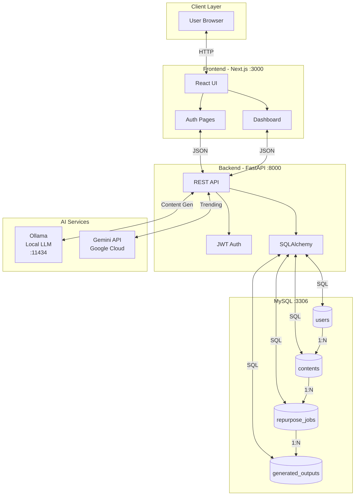
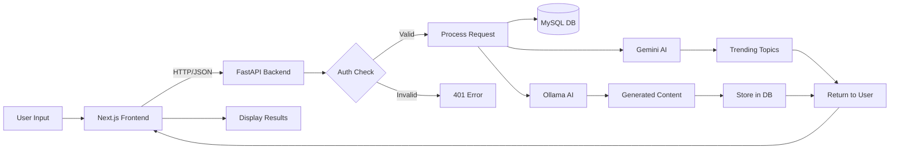
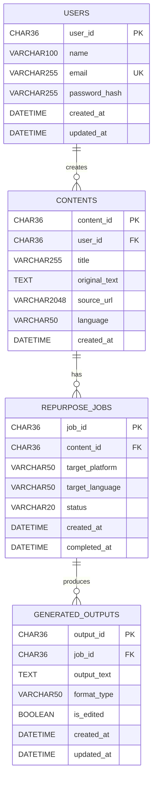
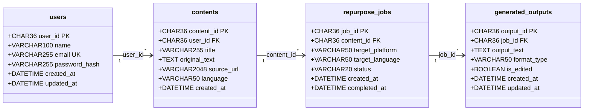

# AI Content Repurposer - PPT Presentation Content

---

## SLIDE 1: Project Title

### AI CONTENT REPURPOSER
**Intelligent Multi-Platform Content Transformation System**

**Team Members:**

| S.No | Register No. | Name of the Student |
|------|--------------|---------------------|
| 1    | [REG_NO_1]   | [STUDENT_NAME_1]    |
| 2    | [REG_NO_2]   | [STUDENT_NAME_2]    |
| 3    | [REG_NO_3]   | [STUDENT_NAME_3]    |
| 4    | [REG_NO_4]   | [STUDENT_NAME_4]    |

**Course:** Database Management Systems  
**Academic Year:** 2025-2026

---

## SLIDE 2: Motivations

- Content creators spend 60-70% of their time reformatting content for different platforms
- Manual repurposing leads to inconsistent brand messaging across channels
- Small businesses and individuals cannot afford dedicated social media teams
- Growing demand for presence on multiple platforms (LinkedIn, Twitter, Instagram, YouTube)
- AI technology has matured enough to understand context and generate human-like content
- Need for multilingual content to reach global audiences
- Time-sensitive content (trending topics) requires rapid adaptation
- Existing tools are expensive ($50-500/month) and lack customization
- Local AI models (Ollama) now enable privacy-focused content generation
- Rising importance of SEO-optimized content across all digital platforms

---

## SLIDE 3: Challenges / Issues

- Maintaining consistent tone and brand voice across different platform formats
- Each platform has unique character limits, hashtag requirements, and formatting rules
- AI-generated content often lacks emotional depth and human touch
- Ensuring factual accuracy when AI transforms original content
- Handling multilingual translations while preserving context and idioms
- Real-time trending topic integration requires live web data access
- Managing API rate limits and costs for AI services (Gemini, Ollama)
- Secure storage of user credentials and sensitive content
- Scalability issues when processing large volumes of content simultaneously
- Preventing AI hallucinations and maintaining content authenticity
- Cross-browser compatibility and responsive design challenges
- Database optimization for storing large text content efficiently

---

## SLIDE 4: Problem Statement

**To design and develop an AI-powered web application that:**

- Accepts long-form content (blogs, articles, essays) as input
- Automatically transforms content into platform-specific formats:
  - LinkedIn posts and articles
  - Twitter/X threads and tweets
  - Instagram captions and carousel text
  - Email newsletters
  - YouTube video scripts and Shorts scripts
- Supports multilingual content repurposing (13+ languages)
- Integrates real-time trending topic discovery using Google Gemini AI
- Generates viral-optimized content suggestions based on current trends
- Provides secure user authentication and content management
- Stores all generated content in a MySQL database for future access
- Offers a modern, responsive dark-themed user interface

---

## SLIDE 5: Abstract

- Web-based AI Content Repurposer built using FastAPI (Python) backend and Next.js (React) frontend
- Utilizes dual AI integration: Ollama for local content generation and Google Gemini for trending analysis
- Implements JWT-based authentication for secure user sessions
- MySQL database stores users, content, repurpose jobs, and generated outputs
- RESTful API architecture with async/await for high performance
- Real-time trending content discovery using Gemini's Google Search Grounding
- Supports 6 output platforms: LinkedIn, Twitter, Instagram, Email, YouTube Script, YouTube Shorts
- Multilingual support for 13 languages including English, Spanish, French, Hindi, Chinese
- Modern UI with Tailwind CSS, Framer Motion animations, and dark theme
- Modular, scalable architecture following industry best practices

---

## SLIDE 6: Existing Work

- **Hootsuite/Buffer:** Social media scheduling tools without AI content generation
- **Copy.ai:** AI writing tool but lacks multi-platform optimization
- **Jasper AI:** Expensive ($49-125/month), cloud-only, no local AI option
- **ChatGPT:** General-purpose AI, requires manual prompting for each platform
- **Canva:** Design-focused, limited text repurposing capabilities
- **Repurpose.io:** Video-focused, lacks text content transformation
- **Lately.ai:** Enterprise-focused, not suitable for individual creators
- **Limitations of existing solutions:**
  - High subscription costs for quality features
  - No local/offline AI processing option
  - Limited trending topic integration
  - No unified dashboard for all platforms
  - Lack of multilingual support in single tool

---

## SLIDE 7: Proposed Work / Application

- **Single Input, Multiple Outputs:** One content piece generates 6 platform-specific versions
- **Dual AI Engine:**
  - Ollama (Local): Privacy-focused content generation without data leaving user's machine
  - Gemini (Cloud): Real-time trending topic discovery with Google Search Grounding
- **Trending Content Dashboard:** Live trending topics from Twitter, LinkedIn, Instagram, YouTube, Reddit
- **Viral Content Generator:** AI-optimized content based on current trends
- **User Features:**
  - Secure registration and login with JWT authentication
  - Personal content library with search and pagination
  - Edit and customize generated outputs
  - Copy-to-clipboard functionality
- **Technical Features:**
  - Async API for non-blocking operations
  - MySQL database with proper indexing and relationships
  - Responsive design for desktop and mobile
  - Real-time status updates during content generation

---

## SLIDE 8: Architecture Diagram / Data Flow Diagram

### System Architecture (Mermaid Code)



### Data Flow Diagram (Mermaid Code)



---

## SLIDE 9: SQL Commands for Entities / Attributes

### 1. USERS TABLE

```sql
CREATE TABLE users (
    user_id CHAR(36) PRIMARY KEY,
    name VARCHAR(100) NOT NULL,
    email VARCHAR(255) NOT NULL UNIQUE,
    password_hash VARCHAR(255) NOT NULL,
    created_at DATETIME NOT NULL DEFAULT CURRENT_TIMESTAMP,
    updated_at DATETIME DEFAULT CURRENT_TIMESTAMP ON UPDATE CURRENT_TIMESTAMP,
    INDEX idx_email (email)
);

-- Sample INSERT
INSERT INTO users (user_id, name, email, password_hash, created_at)
VALUES (
    UUID(),
    'John Doe',
    'john@example.com',
    '$2b$12$hashedpassword...',
    NOW()
);

-- Sample SELECT
SELECT user_id, name, email, created_at FROM users WHERE email = 'john@example.com';

-- Sample UPDATE
UPDATE users SET name = 'John Smith', updated_at = NOW() WHERE user_id = 'uuid-here';

-- Sample DELETE
DELETE FROM users WHERE user_id = 'uuid-here';
```

### 2. CONTENTS TABLE

```sql
CREATE TABLE contents (
    content_id CHAR(36) PRIMARY KEY,
    user_id CHAR(36) NOT NULL,
    title VARCHAR(255),
    original_text TEXT NOT NULL,
    source_url VARCHAR(2048),
    language VARCHAR(50) NOT NULL DEFAULT 'English',
    created_at DATETIME NOT NULL DEFAULT CURRENT_TIMESTAMP,
    INDEX idx_user_id (user_id),
    FOREIGN KEY (user_id) REFERENCES users(user_id) ON DELETE CASCADE
);

-- Sample INSERT
INSERT INTO contents (content_id, user_id, title, original_text, language, created_at)
VALUES (
    UUID(),
    'user-uuid-here',
    'AI Revolution in 2026',
    'Artificial Intelligence is transforming every industry...',
    'English',
    NOW()
);

-- Sample SELECT with JOIN
SELECT c.content_id, c.title, c.language, u.name as author
FROM contents c
JOIN users u ON c.user_id = u.user_id
WHERE c.user_id = 'user-uuid-here'
ORDER BY c.created_at DESC;

-- Sample COUNT
SELECT COUNT(*) as total_contents FROM contents WHERE user_id = 'user-uuid-here';
```

### 3. REPURPOSE_JOBS TABLE

```sql
CREATE TABLE repurpose_jobs (
    job_id CHAR(36) PRIMARY KEY,
    content_id CHAR(36) NOT NULL,
    target_platform VARCHAR(50) NOT NULL,
    target_language VARCHAR(50) NOT NULL DEFAULT 'English',
    status VARCHAR(20) NOT NULL DEFAULT 'pending',
    created_at DATETIME NOT NULL DEFAULT CURRENT_TIMESTAMP,
    completed_at DATETIME,
    INDEX idx_content_id (content_id),
    INDEX idx_status (status),
    FOREIGN KEY (content_id) REFERENCES contents(content_id) ON DELETE CASCADE
);

-- Sample INSERT
INSERT INTO repurpose_jobs (job_id, content_id, target_platform, target_language, status, created_at)
VALUES (
    UUID(),
    'content-uuid-here',
    'linkedin',
    'English',
    'pending',
    NOW()
);

-- Sample UPDATE (status change)
UPDATE repurpose_jobs 
SET status = 'completed', completed_at = NOW() 
WHERE job_id = 'job-uuid-here';

-- Sample SELECT with aggregation
SELECT target_platform, COUNT(*) as job_count, 
       SUM(CASE WHEN status = 'completed' THEN 1 ELSE 0 END) as completed
FROM repurpose_jobs
WHERE content_id = 'content-uuid-here'
GROUP BY target_platform;
```

### 4. GENERATED_OUTPUTS TABLE

```sql
CREATE TABLE generated_outputs (
    output_id CHAR(36) PRIMARY KEY,
    job_id CHAR(36) NOT NULL,
    output_text TEXT NOT NULL,
    format_type VARCHAR(50) NOT NULL,
    is_edited BOOLEAN NOT NULL DEFAULT FALSE,
    created_at DATETIME NOT NULL DEFAULT CURRENT_TIMESTAMP,
    updated_at DATETIME DEFAULT CURRENT_TIMESTAMP ON UPDATE CURRENT_TIMESTAMP,
    INDEX idx_job_id (job_id),
    FOREIGN KEY (job_id) REFERENCES repurpose_jobs(job_id) ON DELETE CASCADE
);

-- Sample INSERT
INSERT INTO generated_outputs (output_id, job_id, output_text, format_type, created_at)
VALUES (
    UUID(),
    'job-uuid-here',
    'Excited to share insights on AI transformation...',
    'post',
    NOW()
);

-- Complex JOIN query (Get all outputs for a user's content)
SELECT 
    c.title,
    rj.target_platform,
    rj.status,
    go.output_text,
    go.format_type,
    go.created_at
FROM users u
JOIN contents c ON u.user_id = c.user_id
JOIN repurpose_jobs rj ON c.content_id = rj.content_id
JOIN generated_outputs go ON rj.job_id = go.job_id
WHERE u.user_id = 'user-uuid-here'
ORDER BY go.created_at DESC;
```

### 5. ADDITIONAL SQL OPERATIONS

```sql
-- Transaction Example
START TRANSACTION;
INSERT INTO contents (content_id, user_id, title, original_text) VALUES (...);
INSERT INTO repurpose_jobs (job_id, content_id, target_platform) VALUES (...);
COMMIT;

-- View Creation
CREATE VIEW user_content_summary AS
SELECT 
    u.user_id,
    u.name,
    COUNT(DISTINCT c.content_id) as total_contents,
    COUNT(DISTINCT rj.job_id) as total_jobs,
    COUNT(DISTINCT go.output_id) as total_outputs
FROM users u
LEFT JOIN contents c ON u.user_id = c.user_id
LEFT JOIN repurpose_jobs rj ON c.content_id = rj.content_id
LEFT JOIN generated_outputs go ON rj.job_id = go.job_id
GROUP BY u.user_id, u.name;

-- Index for performance
CREATE INDEX idx_contents_created ON contents(created_at DESC);
CREATE INDEX idx_jobs_platform_status ON repurpose_jobs(target_platform, status);
```

---

## SLIDE 10: ER Diagram

### ER Diagram (Mermaid Code)



---

## SLIDE 11: Transformation from ER to Relational Schema

### Step-by-Step Transformation:

#### Step 1: Map Strong Entities to Relations

| Entity | Relation (Table) | Primary Key |
|--------|------------------|-------------|
| USERS | users | user_id |
| CONTENTS | contents | content_id |
| REPURPOSE_JOBS | repurpose_jobs | job_id |
| GENERATED_OUTPUTS | generated_outputs | output_id |

#### Step 2: Map Attributes to Columns

**USERS Entity -> users Relation:**
```
users(user_id, name, email, password_hash, created_at, updated_at)
```

**CONTENTS Entity -> contents Relation:**
```
contents(content_id, user_id, title, original_text, source_url, language, created_at)
```

**REPURPOSE_JOBS Entity -> repurpose_jobs Relation:**
```
repurpose_jobs(job_id, content_id, target_platform, target_language, status, created_at, completed_at)
```

**GENERATED_OUTPUTS Entity -> generated_outputs Relation:**
```
generated_outputs(output_id, job_id, output_text, format_type, is_edited, created_at, updated_at)
```

#### Step 3: Map 1:N Relationships (Foreign Keys)

| Relationship | Parent Table | Child Table | Foreign Key Added To |
|--------------|--------------|-------------|---------------------|
| USERS creates CONTENTS | users | contents | contents.user_id -> users.user_id |
| CONTENTS has REPURPOSE_JOBS | contents | repurpose_jobs | repurpose_jobs.content_id -> contents.content_id |
| REPURPOSE_JOBS produces GENERATED_OUTPUTS | repurpose_jobs | generated_outputs | generated_outputs.job_id -> repurpose_jobs.job_id |

---

### Final Relational Schema (Mermaid Code):



### Relational Schema Notation:

```
users (user_id, name, email, password_hash, created_at, updated_at)
      --------       -----
         PK           UK

contents (content_id, user_id, title, original_text, source_url, language, created_at)
          ----------  -------
              PK        FK → users.user_id

repurpose_jobs (job_id, content_id, target_platform, target_language, status, created_at, completed_at)
                ------  ----------
                  PK      FK → contents.content_id

generated_outputs (output_id, job_id, output_text, format_type, is_edited, created_at, updated_at)
                   ---------  ------
                      PK       FK → repurpose_jobs.job_id
```

---

### Functional Dependencies:

```
users:
    user_id -> name, email, password_hash, created_at, updated_at
    email -> user_id (candidate key)

contents:
    content_id -> user_id, title, original_text, source_url, language, created_at

repurpose_jobs:
    job_id -> content_id, target_platform, target_language, status, created_at, completed_at

generated_outputs:
    output_id -> job_id, output_text, format_type, is_edited, created_at, updated_at
```

---

### Normalization Verification:

| Normal Form | Status | Reason |
|-------------|--------|--------|
| **1NF** | Yes | All attributes are atomic, no repeating groups |
| **2NF** | Yes | No partial dependencies (all non-key attributes depend on entire PK) |
| **3NF** | Yes | No transitive dependencies (non-key attributes don't depend on other non-key attributes) |
| **BCNF** | Yes | Every determinant is a candidate key |

---

### Referential Integrity Constraints:

```sql
-- Foreign Key Constraints with CASCADE DELETE
ALTER TABLE contents 
    ADD CONSTRAINT fk_contents_user 
    FOREIGN KEY (user_id) REFERENCES users(user_id) ON DELETE CASCADE;

ALTER TABLE repurpose_jobs 
    ADD CONSTRAINT fk_jobs_content 
    FOREIGN KEY (content_id) REFERENCES contents(content_id) ON DELETE CASCADE;

ALTER TABLE generated_outputs 
    ADD CONSTRAINT fk_outputs_job 
    FOREIGN KEY (job_id) REFERENCES repurpose_jobs(job_id) ON DELETE CASCADE;
```

### Key Constraints Summary:

| Constraint Type | Table | Column(s) | Description |
|-----------------|-------|-----------|-------------|
| PRIMARY KEY | users | user_id | Unique identifier |
| PRIMARY KEY | contents | content_id | Unique identifier |
| PRIMARY KEY | repurpose_jobs | job_id | Unique identifier |
| PRIMARY KEY | generated_outputs | output_id | Unique identifier |
| UNIQUE | users | email | No duplicate emails |
| FOREIGN KEY | contents | user_id | References users |
| FOREIGN KEY | repurpose_jobs | content_id | References contents |
| FOREIGN KEY | generated_outputs | job_id | References repurpose_jobs |
| NOT NULL | All tables | Various | Data integrity |
| DEFAULT | Multiple | Various | Default values |

---

## SLIDE 11: Technologies Used (Bonus Slide)

### Backend:
- Python 3.13
- FastAPI (Async Web Framework)
- SQLAlchemy (ORM)
- MySQL 8.0 (Database)
- JWT (Authentication)
- Bcrypt (Password Hashing)

### Frontend:
- Next.js 14 (React Framework)
- TypeScript
- Tailwind CSS (Styling)
- Framer Motion (Animations)

### AI Integration:
- Ollama (Local LLM - llama2)
- Google Gemini 2.5 Flash (Cloud AI)
- Google Search Grounding (Real-time Data)

---

## SLIDE 12: Conclusion (Bonus Slide)

- Successfully developed a full-stack AI Content Repurposer application
- Implemented secure user authentication with JWT tokens
- Designed normalized database schema with 4 interconnected tables
- Integrated dual AI engines for content generation and trend analysis
- Created responsive, modern UI with dark theme
- Demonstrated practical application of DBMS concepts:
  - Entity-Relationship modeling
  - SQL DDL and DML operations
  - Foreign key constraints and cascading
  - Indexing for query optimization
  - Transaction management

---

*Note: Replace [REG_NO_X] and [STUDENT_NAME_X] with actual team member details in ascending order of register numbers.*
